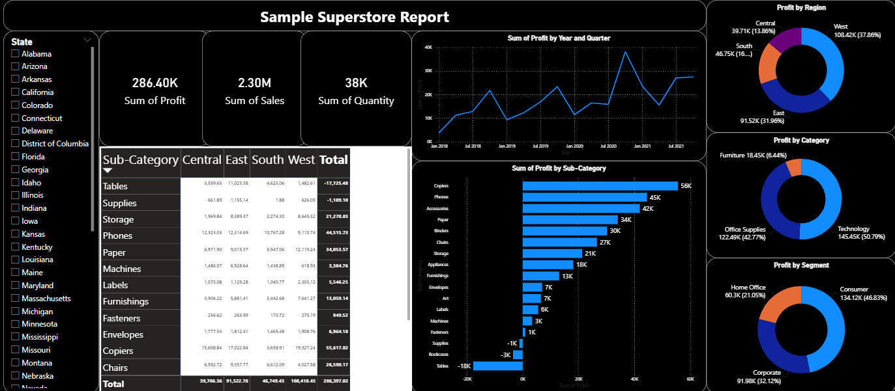

# 📊 Power BI Sales Dashboard – Superstore Report

This project is a **Power BI dashboard** designed to analyze and visualize key insights from a sample Superstore dataset.

##  About the Dashboard

This dashboard provides interactive visualizations to track:
- 💰 **Profit trends over time**
- 📦 **Sales by category and sub-category**
- 🌍 **Regional and segment-wise analysis**
- 📈 **Top-performing and underperforming products**

##  Key Metrics

- **Sum of Profit:** 286.40K  
- **Sum of Sales:** 2.30M  
- **Sum of Quantity:** 38K  

## Visuals Included

- 📉 **Line Chart**: Profit trend by Year and Quarter  
- 📊 **Bar Chart**: Profit by Sub-Category  
- 🍩 **Doughnut Charts**:  
  - Profit by Region  
  - Profit by Category  
  - Profit by Segment  
- 📋 **Matrix Table**: Sub-category performance by region  
- 🗂️ **Slicer**: Filter by U.S. States  

## 🛠️ How to Use

1. Download and install [Power BI Desktop](https://powerbi.microsoft.com/desktop/)
2. Clone or download this repository
3. Open `dashboard.pbix` in Power BI Desktop
4. Interact with slicers, filters, and visuals to explore insights

## 📁 Files Included

| File Name        | Description                              |
|------------------|------------------------------------------|
| `dashboard.pbix` | Power BI file with the full report       |
| `dashboard.png`  | Preview image used in this README        |
| `README.md`      | Documentation for the project            |

## 👩‍💻 Author

**Sanika Sankpal**  
B.Tech CSE | DY Patil College of Engineering & Technology, Kolhapur  

⭐ If you found this project helpful, feel free to give it a ⭐ on GitHub!
